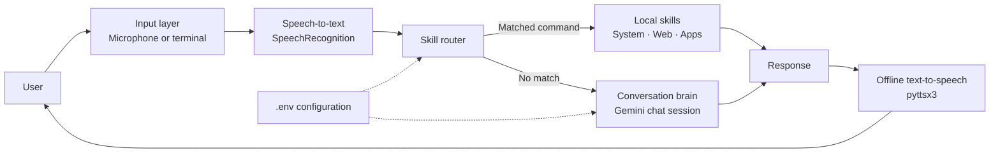

# Katarina AI Assistant

> A privacy-conscious, voice-enabled desktop assistant with local skills and an optional Gemini-powered conversational layer.

Katarina is designed around a fast, extensible command router: deterministic actions such as checking the time, opening an application, or searching the web execute locally, while open-ended requests can be delegated to Google Gemini. Voice input and output are optional; the assistant remains usable from a terminal with typed input.

---

## Architecture diagram



### Project structure

```text
.
├── main.py                 # Application loop and orchestration
├── config.py               # Environment-backed configuration
├── brain.py                # Gemini client and conversation history
├── stt.py                  # Microphone and typed-input fallback
├── tts.py                  # Offline speech output
├── skills/
│   ├── __init__.py         # Skill registry and router
│   ├── system.py           # Time, date, volume, help, exit
│   ├── web.py              # Search and common websites
│   └── apps.py              # Local application launching
├── requirements.txt
└── .env.example
```

## System workflow

1. Load configuration from environment variables and an optional `.env` file.
2. Initialize the speaker and listener. If audio dependencies or devices are unavailable, fall back to terminal I/O.
3. Capture one user command.
4. Normalize the command and check registered local skills in order.
5. Execute a matching skill without using the network where possible.
6. If no skill matches, send the message to Gemini when an API key is configured.
7. Print the response and optionally speak it aloud.
8. Continue until the user says `goodbye`, `exit`, `quit`, or presses `Ctrl+C`.

## Feature list

- **Voice input:** microphone capture with Google Speech Recognition.
- **Typed fallback:** works without a microphone, PyAudio, or sounddevice.
- **Offline speech output:** cross-platform `pyttsx3` integration.
- **Local system skills:** current time, date, volume controls, help, and exit.
- **Web skills:** Google search and shortcuts for YouTube, Gmail, GitHub, and Reddit.
- **Application skills:** launch configured applications such as Calculator, Terminal, Spotify, and VS Code.
- **Conversational AI:** Gemini chat sessions preserve context across turns.
- **Configurable runtime:** model, voice, timeouts, assistant name, and speech settings are environment controlled.
- **Graceful degradation:** local commands continue working without a Gemini key or audio hardware.
- **Extensible skill registry:** add a matcher and handler without changing the main loop.

## API documentation

Katarina is currently a local CLI application and does not expose an HTTP server. Its internal Python interfaces are the supported API for extensions.

### `skills.try_skills(text)`

```python
from skills import try_skills

response = try_skills("what time is it")
# Returns a response string, or None when no skill matches.
```

### Skill contract

Each skill module exports a `SKILLS` list containing `(matcher, handler)` pairs:

```python
def matcher(text: str) -> bool:
    ...

def handler(text: str) -> str:
    ...

SKILLS = [(matcher, handler)]
```

Matchers receive normalized lowercase text. Handlers return text suitable for both terminal output and speech synthesis.

### `Brain`

```python
from brain import Brain

brain = Brain()                 # requires GEMINI_API_KEY
answer = brain.think("Hello")  # maintains chat history
brain.reset()                   # starts a fresh conversation
```

## Database schema

Katarina does not currently use a database. It is intentionally stateless on disk: conversation history lives in the active Gemini chat session and is discarded when the process exits. No migrations, credentials, or persistent user records are required.

If persistence is added later, isolate it behind a storage interface and avoid storing raw microphone audio or API secrets by default.

## AI architecture

The AI layer uses a two-tier architecture:

- **Tier 1 — deterministic local skills:** fast, predictable, free, and suitable for actions with side effects. Skill matching happens before any model request.
- **Tier 2 — Gemini conversation brain:** receives only unmatched requests and uses a configured system prompt plus a persistent chat session for contextual responses.
- **Output layer:** responses are always printed; optional offline TTS reads them aloud.

This separation keeps common actions low-latency and limits unnecessary transmission of commands to a third-party model.

## Security considerations

- Store credentials only in `.env`; never commit `.env` or hard-code API keys.
- Treat the Gemini API key as a secret and rotate it if exposed.
- Review and constrain new skills because application launching and system controls have side effects.
- Do not pass untrusted user text directly into shell commands. Prefer argument lists with `subprocess` and explicit allowlists.
- Web searches open a browser using encoded query parameters; no arbitrary URL execution is provided by the current skills.
- Microphone audio is sent to the configured speech-recognition service when voice input is enabled. Disable it with `VOICE_ENABLED=false` when privacy is required.
- Gemini requests may contain user commands and conversation context. Use local-only skills for sensitive workflows.
- Run the assistant with the minimum operating-system permissions necessary.

## Testing

Run a syntax check and smoke-test the local router:

```bash
python -m compileall -q .
python - <<'PY'
from skills import try_skills

assert try_skills("help")
assert try_skills("what time is it")
assert try_skills("an unmatched conversation prompt") is None
print("Local skill smoke tests passed")
PY
```

For deterministic tests, mock `webbrowser.open`, `subprocess.Popen`, microphone input, and the Gemini client. Hardware-dependent microphone and speaker tests should run separately from CI.

## Docker setup

The assistant can run in text-only mode inside a container. Microphone access and desktop application launching are host-dependent and are not enabled by this minimal setup.

Create a `Dockerfile` in the project root:

```dockerfile
FROM python:3.12-slim
WORKDIR /app
COPY requirements.txt .
RUN pip install --no-cache-dir -r requirements.txt
COPY . .
ENV VOICE_ENABLED=false
CMD ["python", "main.py"]
```

Build and run:

```bash
docker build -t katarina .
docker run --rm -it --env-file .env katarina
```

For production images, pin dependency versions, use a non-root user, and provide only the environment variables required by the deployment.

## CI/CD

A recommended pipeline is:

1. Install the supported Python version.
2. Install dependencies.
3. Run `compileall` and unit/smoke tests.
4. Build the Docker image if container deployment is enabled.
5. Scan dependencies and the image for known vulnerabilities.
6. Publish only from protected branches after review.

CI must inject `GEMINI_API_KEY` through the secret store only when integration tests require it. Local skill tests should run without network access or credentials.

## Screenshots

No screenshots are bundled yet because Katarina is a terminal and desktop-audio application rather than a web UI. Recommended captures for a future release:

- Startup in text-only fallback mode.
- A local command such as `what time is it`.
- A web search or application-launch response.
- A Gemini conversation turn.

Store approved images under `docs/screenshots/` and reference them here.

## Demo

### Install

```bash
python -m venv .venv
source .venv/bin/activate       # Windows: .venv\Scripts\activate
pip install -r requirements.txt
cp .env.example .env
```

Add a Gemini key to `.env` for conversational responses:

```env
GEMINI_API_KEY=AIza...
```

### Run

```bash
python main.py
```

Try:

```text
What time is it?
Help
Search for best pizza near me
Open browser
Explain quantum entanglement simply
Goodbye
```

Without a Gemini key, local skills still work and unmatched requests receive a clear offline-mode response.

## Configuration reference

| Variable | Default | Purpose |
|---|---:|---|
| `GEMINI_API_KEY` | unset | Enables conversational responses |
| `GEMINI_MODEL` | `gemini-flash-latest` | Gemini model name |
| `GEMINI_MAX_TOKENS` | `1024` | Maximum generated response tokens |
| `VOICE_ENABLED` | `true` | Enables microphone and speech output |
| `TTS_RATE` | `185` | Speech rate in words per minute |
| `TTS_VOLUME` | `1.0` | TTS volume from 0.0 to 1.0 |
| `MIC_TIMEOUT` | `6` | Seconds to wait for speech |
| `MIC_PHRASE_LIMIT` | `12` | Maximum phrase duration |
| `ASSISTANT_NAME` | `Katarina` | Startup name and AI persona |

## License

See the repository license file. If none is present, add one before distributing the project.
